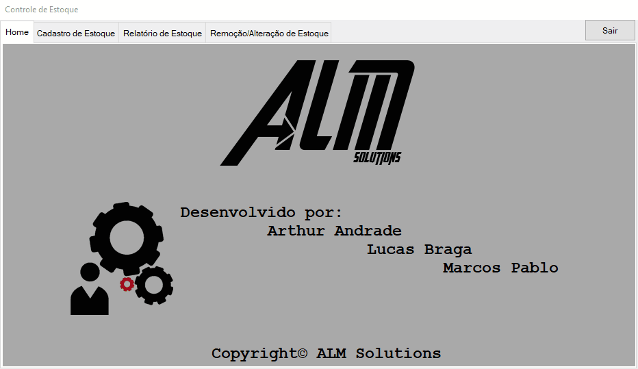

# Programação Orientada a Objetos - Controle de Estoque
Sistema desenvolvido para controle de estoque de um supermercado, onde é possível manter, editar e remover objetos além de fornecer recursos de interface como filtros e notificações.

## Desafio proposto :clipboard:
O Desafio proposto pelo professor de desenvolver um sistema utilizando WindowsForms na linguagem C# utilizando os conceitos de MVC para dividir as responsabilidades da aplicação, utilizando bastante das Classes e Objetos para a aplicação. 

##  GIF representando a interface :movie_camera:

## Licença
Este projeto está sob a Licença [MIT](LICENSE.md).
